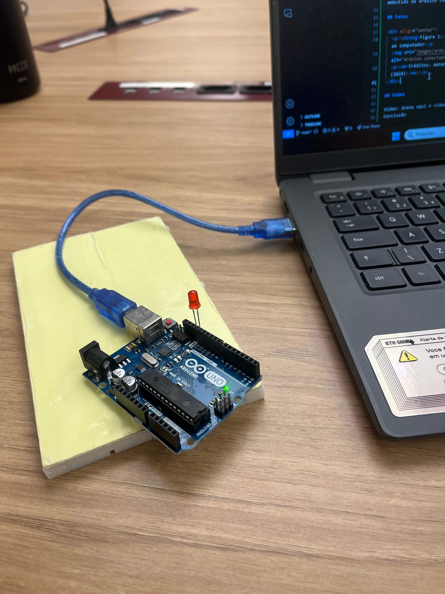
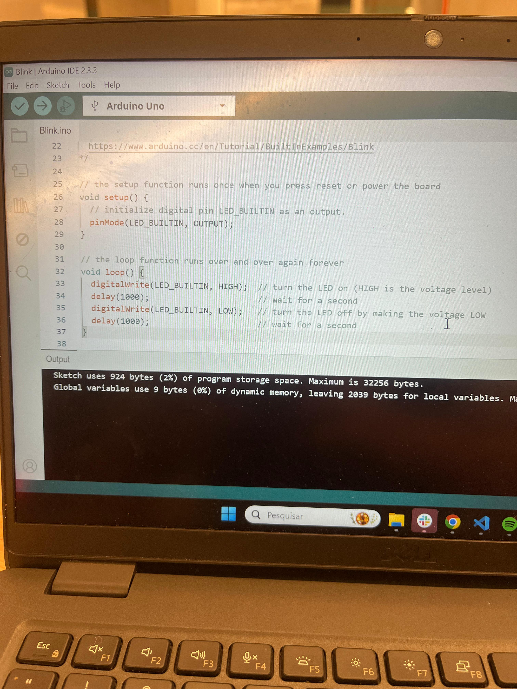
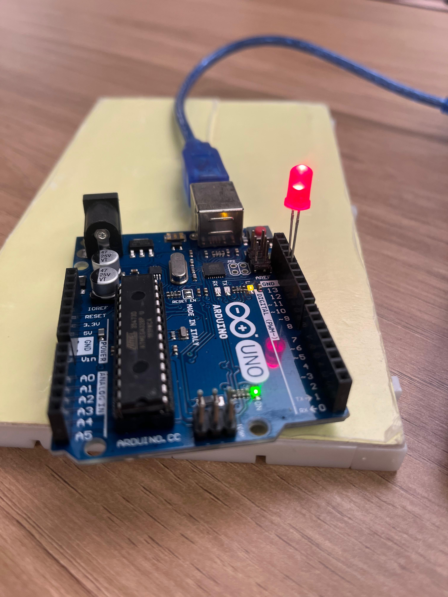
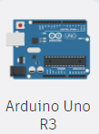
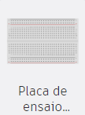
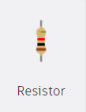
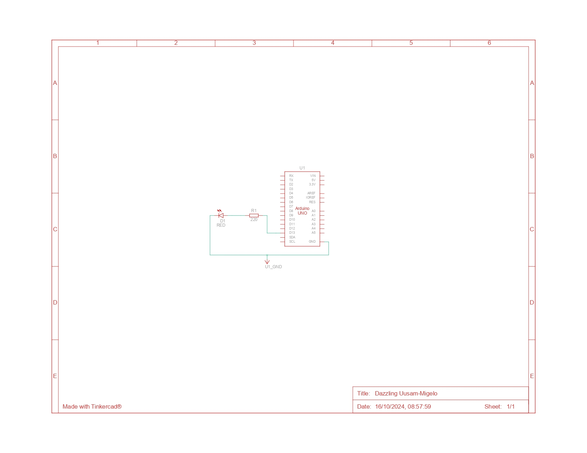

# Ponderada Programação - Módulo 4 - Semana 01

## Parte 1: Blink Led Interno

Este repositório contém a documentação para fazer o LED interno do Arduino piscar, utilizando a Arduino IDE.

### Requisitos para a realização da atividade
Antes de iniciar, certifique-se de que você possui:

- Arduino Uno
- Cabo USB para conectar o Arduino ao computador
- Arduino IDE instalada na sua máquina
- Led

### Passo-a-Passo

1. **Instalar a Arduino IDE**
Baixe e instale a Arduino IDE no seu computador clicando [aqui](https://www.arduino.cc/en/software)
2. **Abra a IDE após a instalação.**
3. **Conectar o Arduino**
Conecte o Arduino Uno ao seu computador utilizando o cabo USB. O Arduino IDE deve reconhecer automaticamente o dispositivo.
4. **Seleção do modelo no IDE**
Selecione o modelo Arduino Uno em Ferramentas > Placa > Arduino Uno. Em seguida, selecione a porta correta em Ferramentas > Porta (normalmente aparece o nome do Arduino seguido da porta, por exemplo, COM3).

4. **Ação Blink** Selecionar o Exemplo "Blink"
Na Arduino IDE, vá até a aba Arquivo > Exemplos > 01.Basics > Blink.
O código do exemplo "Blink" aparecerá automaticamente na tela da IDE.
Esse código faz o LED embutido piscar, permanecendo aceso por um tempo determinado e depois apagando por um período, repetidamente.

4. **Upload** Fazer Upload do Código
Com o código já inserido, clique no botão Verificar (ícone de "check") para compilar.
Depois, clique no botão Carregar (ícone de seta) para enviar o código ao Arduino.
Se tudo estiver funcionando corretamente, o LED embutido no Arduino começará a piscar.

### Código de Piscar LED com Arduino

```cpp
void setup() {
  // initialize digital pin LED_BUILTIN as an output.
  pinMode(LED_BUILTIN, OUTPUT);
}

// the loop function runs over and over again forever
void loop() {
  digitalWrite(LED_BUILTIN, HIGH);  // turn the LED on (HIGH is the voltage level)
  delay(1000);                      // wait for a second
  digitalWrite(LED_BUILTIN, LOW);   // turn the LED off by making the voltage LOW
  delay(1000);                      // wait for a second
}
```

### Fotos

<div align="center">
  <p><strong>Figura 1:</strong> Arduino conectado ao computador</p>
  
  <p><em>Créditos: material produzido pelo autor (2024)</em></p>
</div>

<div align="center">
  <p><strong>Figura 2:</strong> IDE </p>
  
  <p><em>Créditos: material produzido pelo autor (2024)</em></p>
</div>

<div align="center">
  <p><strong>Figura 3: Led aceso</strong> IDE </p>
  
  <p><em>Créditos: material produzido pelo autor (2024)</em></p>
</div>

### Vídeo

Para acessar o vídeo do led piscando, clique [aqui](https://github.com/zzaved/PONDERADA-PROG-M4-S1/blob/main/assets/video_blink.mp4) </a>

### Conclusão
O projeto "Blink" permite demonstrar o funcionamento básico de controle do LED embutido no Arduino Uno. As imagens e o vídeo mostram o processo e o resultado final.

## Parte 2: Simulando Blink Externo

Nesta parte, vamos realizar uma simulação do pisca-pisca utilizando um LED externo conectado ao Arduino Uno, usando o TinkerCad.

### Materiais Necessários

| Componente        | Descrição                                |
|-------------------|------------------------------------------|
|  | **Arduino Uno** - Microcontrolador utilizado no projeto. |
|  | **Protoboard** - Usado para montar o circuito sem solda. |
|  | **LED** - Emitir luz quando o circuito estiver energizado. |
|  | **Resistor** - Limitar a corrente elétrica para proteger o LED. |
|  | **Jumpers** - Fios para realizar as conexões no circuito. |


### Configuração no TinkerCad
Vamos configurar um circuito que utiliza o Arduino Uno para controlar um LED externo. O LED piscará seguindo uma cadência programada, de forma similar ao que foi feito com o LED embutido na Parte 1, mas agora utilizando um LED externo.

### Passo-a-Passo

1. **Configurar o Circuito no TinkerCad:**
Adicionar o Arduino Uno e a Protoboard:
Na interface do TinkerCad, adicione um Arduino Uno e uma Protoboard ao ambiente de simulação.

2. **Conectar o LED:**
O terminal negativo do LED deve ser conectado a um resistor e, em seguida, à linha de terra (GND) da protoboard.

3. **Conectar o Resistor:**
Conecte um resistor entre o terminal negativo do LED e a linha de terra (GND). Isso garante que o LED não queime com a corrente fornecida pelo Arduino.

4. **Conectar a Protoboard ao Arduino:**
Conecte a linha positiva da protoboard ao pino do Arduino e a linha negativa ao pino GND do Arduino.

5. **Criar o Código no TinkerCad:**
O código para fazer o LED externo piscar é semelhante ao código do LED embutido. Veja o exemplo:

``` cpp
void setup()
{
  pinMode(13, OUTPUT);
}

void loop()
{
  digitalWrite(LED_BUILTIN, HIGH);
  delay(1000); // Wait for 1000 millisecond(s)
  digitalWrite(LED_BUILTIN, LOW);
  delay(1000); // Wait for 1000 millisecond(s)
}
```

6. **Inserção do código:** Abra a aba de código no TinkerCad e insira o código acima.
7. **Iniciação da simulação:** Clique no botão Iniciar Simulação para verificar se o LED está piscando conforme esperado.

### Link para o Projeto no TinkerCad

Para acessar o Projeto TinkerCad, clique [aqui](https://www.tinkercad.com/things/b2RA69cNG86/editel?sharecode=YspNTp6gc3MwG4sqN6t8K36lWZR_S99fXoBDVQRyIm0)

### Imagem do circuto no TinkerCad

<div align="center">
  <p><strong>Figura 4:</strong>  Imagem do circuito no TinkerCad </p>
  
  <p><em>Créditos: material produzido pelo autor (2024)</em></p>
</div>

### Vista esquemática do circuito

<div align="center">
  <p><strong>Figura 5: Vista esquemática do circuito</strong> </p>
  
  <p><em>Créditos: material produzido pelo autor (2024)</em></p>
</div>

### Conclusão
Este exercício de simulação no TinkerCad permitiu criar um circuito de pisca-pisca com um LED externo conectado ao Arduino Uno, utilizando resistores e uma protoboard. As imagens e o código comprovam o funcionamento correto da simulação.